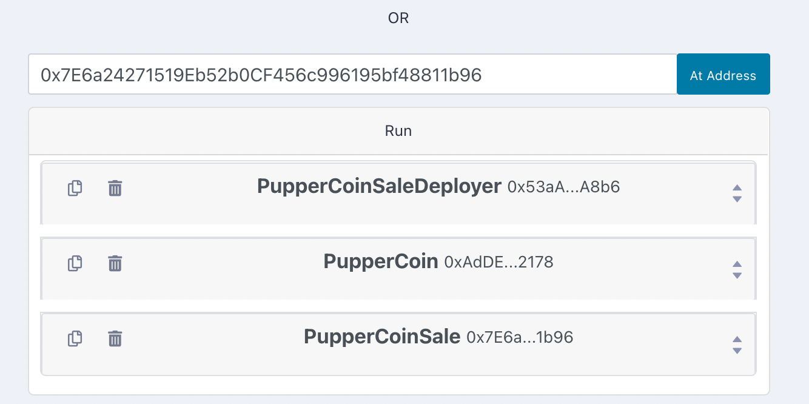
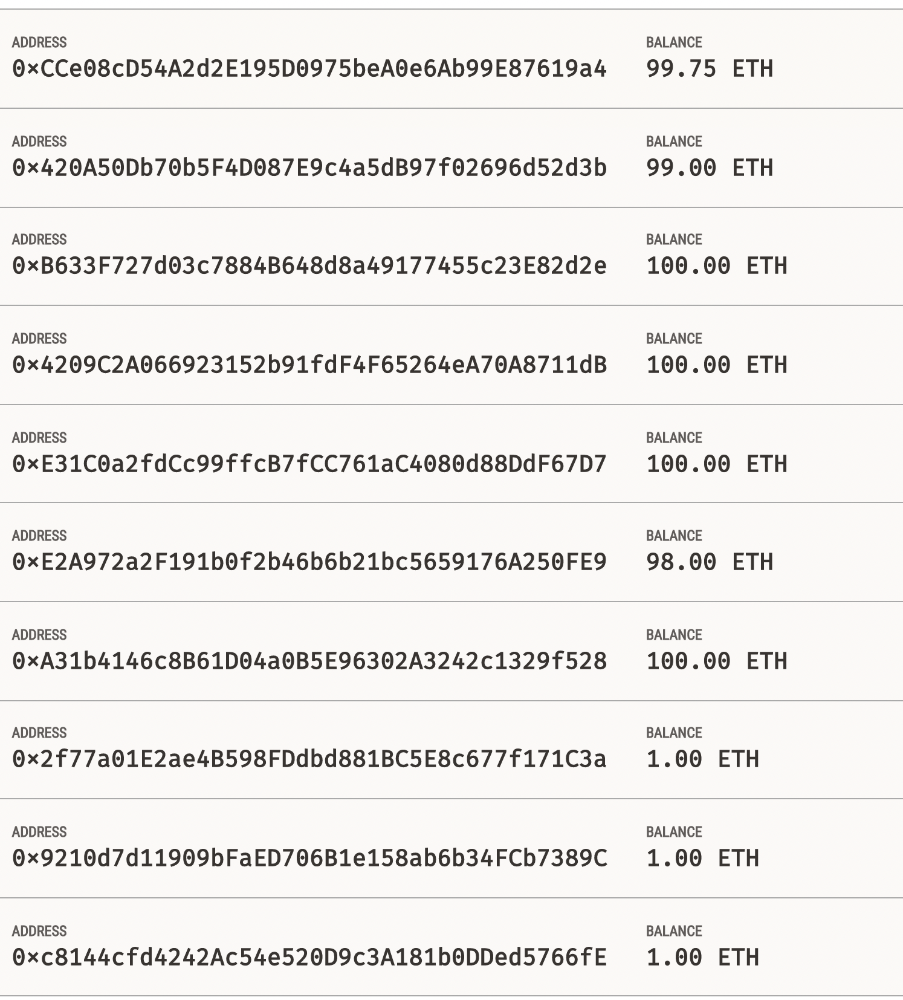

# Unit 21: You sure can attract a crowd!

## Screenshots

1. After writing the smart contract, let's compile them!
2. Compile the [PupperCoin.sol](PupperCoin.sol) first. 
3. Deploy the PupperCoin.sol contract to your local network. 
4. Compile the [PupperCoinCrowdsale.sol](PupperCoinCrowdsale.sol). 
5. Note there are two contracts inside it, we will need to first deploy "PupperCoinSaleDeployer", then "PupperCoinSale". 
6. After deploying all of them, you should have 3 deployed contracts in your dashboard. 
7. Now you can start purchasing PupperCoin through the crowd sale contract, here is an example. 
8. You can check if the transaction successfully go through. 
9. Keep buying until we reach the sales goal of 300 Ether!
10. After that you can check if the goal had been reached or not. 
11. Your account balance should be reduced to something like this after the goal reached. 
12. You can also finalise the crowd sale contract and collect the money after the close time. But my close time is "24 weeks" later, therefore I won't show it here.

## Background

Your company has decided to crowdsale their PupperCoin token in order to help fund the network development.
This network will be used to track dog breeding activity across the globe in a decentralized way, and allow humans to track the genetic trail of their pets. You have already worked with the necessary legal bodies and obtained the green light on creating a crowdsale open to the public. However, you are required to enable refunds if the crowdsale is successful and the goal is met, and you are only allowed to raise a maximum of 300 ether. The crowdsale will run for 24 weeks.

You will need to create an ERC20 token that will be minted through a `Crowdsale` contract that you can leverage from the OpenZeppelin Solidity library.

This crowdsale contract will manage the entire process, allowing users to send ETH and get back PUP (PupperCoin).
This contract will mint the tokens automatically and distribute them to buyers in one transaction.

It will need to inherit `Crowdsale`, `CappedCrowdsale`, `TimedCrowdsale`, `RefundableCrowdsale`, and `MintedCrowdsale`.

You will conduct the crowdsale on the Kovan or Ropsten testnet in order to get a real-world pre-production test in.

## Instructions

### Creating your project

Using Remix, create a file called `PupperCoin.sol` and create a standard `ERC20Mintable` token. Since you're already an expert at this, you can simply use this [starter code](../Starter-Code/PupperCoin.sol).

Create a new contract named `PupperCoinCrowdsale.sol`, and prepare it like a standard crowdsale.

### Designing the contracts

#### ERC20 PupperCoin

You will need to simply use a standard `ERC20Mintable` and `ERC20Detailed` contract, hardcoding `18` as the `decimals` parameter, and leaving the `initial_supply` parameter alone.

You don't need to hardcode the decimals; however, since most use-cases match Ethereum's default, you may do so.

Simply fill in the `PupperCoin.sol` file with this [starter code](../Starter-Code/PupperCoin.sol), which contains the complete contract you'll need to work with in the Crowdsale.

#### PupperCoinCrowdsale

Leverage the [Crowdsale](../Starter-Code/Crowdsale.sol) starter code, saving the file in Remix as `Crowdsale.sol`.

You will need to bootstrap the contract by inheriting the following OpenZeppelin contracts:

- `Crowdsale`

- `MintedCrowdsale`

- `CappedCrowdsale`

- `TimedCrowdsale`

- `RefundablePostDeliveryCrowdsale`

You will need to provide parameters for all of the features of your crowdsale, such as the `name`, `symbol`, `wallet` for fundraising, `goal`, etc. Feel free to configure these parameters to your liking.

You can hardcode a `rate` of 1, to maintain parity with ether units (1 TKN per Ether, or 1 TKNbit per wei). If you'd like to customize your crowdsale rate, follow the [Crowdsale Rate](https://docs.openzeppelin.com/contracts/2.x/crowdsales#crowdsale-rate) calculator on OpenZeppelin's documentation. Essentially, a token (TKN) can be divided into TKNbits just like ether can be divided into wei. When using a `rate` of 1, just like 1000000000000000000 wei is equal to 1 ether, 1000000000000000000 TKNbits is equal to 1 TKN.

Since `RefundablePostDeliveryCrowdsale` inherits the `RefundableCrowdsale` contract, which requires a `goal` parameter, you must call the `RefundableCrowdsale` constructor from your `PupperCoinCrowdsale` constructor, as well as the others. `RefundablePostDeliveryCrowdsale` does not have its own constructor, so just use the `RefundableCrowdsale` constructor that it inherits.

If you forget to call the `RefundableCrowdsale` constructor, the `RefundablePostDeliveryCrowdsale` will fail since it relies on it (it inherits from `RefundableCrowdsale`), and does not have its own constructor.

When passing the `open` and `close` times, use `now` and `now + 24 weeks` to set the times properly from your `PupperCoinCrowdsaleDeployer` contract.

#### PupperCoinCrowdsaleDeployer

In this contract, you will model the deployment based off of the `ArcadeTokenCrowdsaleDeployer` you built previously. Leverage the [OpenZeppelin Crowdsale Documentation](https://docs.openzeppelin.com/contracts/2.x/crowdsales) for an example of a contract deploying another, as well as the starter code provided in [Crowdsale.sol](../Starter-Code/Crowdsale.sol).

### Testing the Crowdsale

Test the crowdsale by sending ether to the crowdsale from a different account (**not** the same account that is raising funds), then once you confirm that the crowdsale works as expected, try to add the token to MyCrypto and test a transaction. You can test the time functionality by replacing `now` with `fakenow`, and creating a setter function to modify `fakenow` to whatever time you want to simulate. You can also set the `close` time to be `now + 5 minutes`, or whatever timeline you'd like to test for a shorter crowdsale.

When sending ether to the contract, make sure you hit the `goal` that you set, and `finalize` the sale using the `Crowdsale`'s `finalize` function. In order to finalize, `isOpen` must return false (`isOpen` comes from `TimedCrowdsale` which checks to see if the `close` time has passed yet). Since the `goal` is 300 ether, you may need to send from multiple accounts. If you run out of prefunded accounts in Ganache, you can create a new workspace.

Remember, the refund feature of `RefundablePostDeliveryCrowdsale` only allows for refunds once the crowdsale is closed **and** the goal is met. See the [OpenZeppelin RefundableCrowdsale](https://docs.openzeppelin.com/contracts/2.x/api/crowdsale#RefundableCrowdsale) documentation for details as to why this logic is used to prevent potential attacks on your token's value.

You can add custom tokens in MyCrypto from the `Add custom token` feature:

You can also do the same for MetaMask. Make sure to purchase higher amounts of tokens in order to see the denomination appear in your wallets as more than a few wei worth.

### Deploying the Crowdsale

Deploy the crowdsale to the Kovan or Ropsten testnet, and store the deployed address for later. Switch MetaMask to your desired network, and use the `Deploy` tab in Remix to deploy your contracts. Take note of the total gas cost, and compare it to how costly it would be in reality. Since you are deploying to a network that you don't have control over, faucets will not likely give out 300 test ether. You can simply reduce the goal when deploying to a testnet to a much smaller amount, like 10,000 wei.

### Submission

Create a Github repo, and a `README.md` file explaining the process for purchasing PupperCoin (or whatever name you came up with).

Also, please provide screenshots to illustrate the functionality (e.g. how you send Ether to the contract, how you add the token to MyCrypto and test a transaction, and how you test the time functionality etc.). Alternatively, you can also record your interactions with the contract as a gif (e.g. https://www.screentogif.com/)

Ensure that anyone can run the steps and add the token to MyCrypto, or a similar wallet.

Include information such as the token parameters, token name, crowdsale cap, etc.

---

### Requirements

#### Deploying the Contracts (30 points)

##### To receive all points, your code must:

- Set up the ERC20 PupperCoin contract. (6 points)
- Set up the PupperCoinCrowdsale with the assigned criteria. (8 points)
- Customize or hardcode the Crowdsale Rate. (8 points)
- Model the PupperCoinCrowdsaleDeployer after the ArcadeTokenCrowdsaleDeployer. (8 points)

#### Testing the Crowdsale (40 points)

##### To receive all points, your code must:

- Test the Crowdsale by sending ether to a different account, then add screenshots of this to the ReadME.md. (10 points)
- Set up the Crowdsale's finalize function with the assigned criteria. (10 points)
- Properly set up the RefundablePostDeliveryCrowdsale. (10 points)
- Deploy the Crowdsale to either the Kovan or Ropsten testnet, then add screenshots of this to the ReadMe.md. (10 points)

#### Coding Conventions and Formatting (10 points)

##### To receive all points, your code must:

- Place imports at the beginning of the file, just after any module comments and docstrings and before module globals and constants. (3 points)
- Name functions and variables with lowercase characters and with words separated by underscores. (2 points)
- Follow Don't Repeat Yourself (DRY) principles by creating maintainable and reusable code. (3 points)
- Use concise logic and creative engineering where possible. (2 points)

#### Deployment and Submission (10 points)

##### To receive all points, you must:

- Submit a link to a GitHub repository that’s cloned to your local machine and contains your files. (5 points)
- Include appropriate commit messages in your files. (5 points)

#### Code Comments (10 points)

##### To receive all points, your code must:

- Be well commented with concise, relevant notes that other developers can understand. (10 points)

---

© 2021 Trilogy Education Services, a 2U, Inc. brand. All Rights Reserved.
